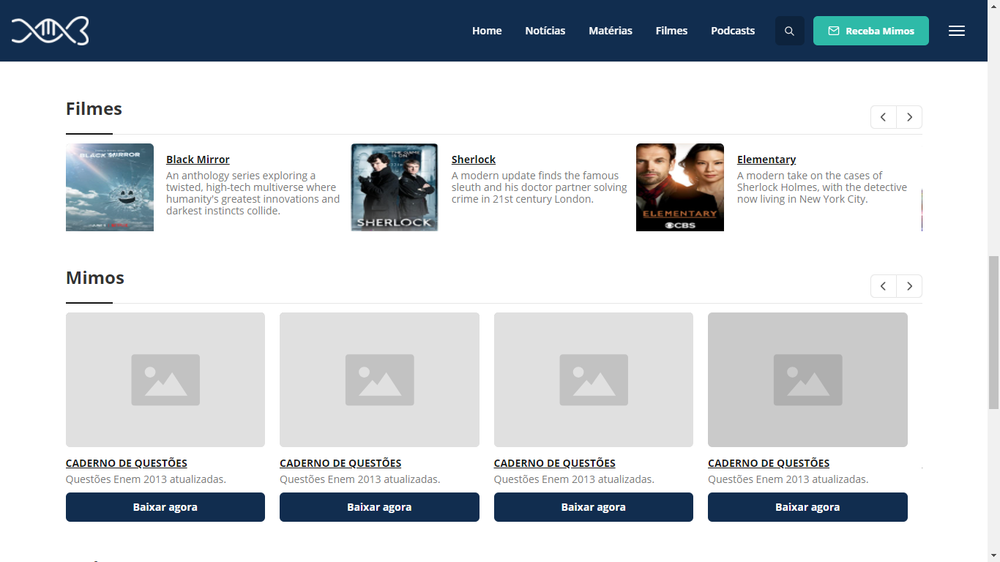

# Projeto de Dinamização com Wordpress

O projeto foi feito usando `PHP/MySQL` e `Wordpress` para dinamizar uma página HTML. 
Após a dinamização, foi adicionado `gulp` (com `npm` e `node`).

#

## Instalação
### Windows

Primeiro, instale [Wamp](https://www.wampserver.com/en/download-wampserver-64bits/) e [Wordpress](https://wordpress.org). Depois, instale `gulp-cli`, clone o repositório (exemplo abaixo) e instale as dependências necessárias com `npm` como no exemplo abaixo:

``` powershell
npm i -g gulp-cli 
git clone https://github.com/paulo-e/teste C:\wamp\www\wordpress\wp-content\themes\teste
npm i
```
